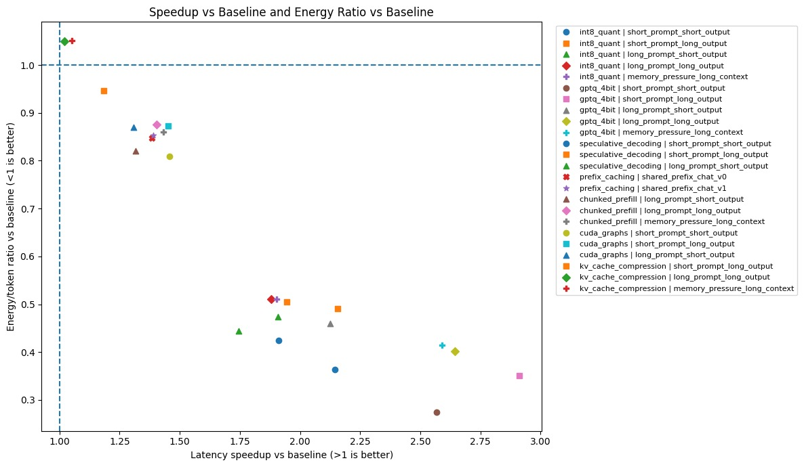
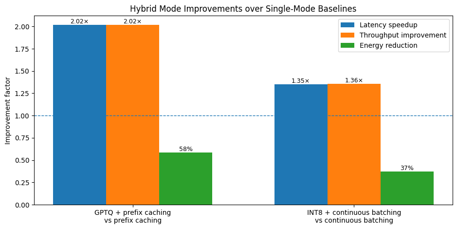
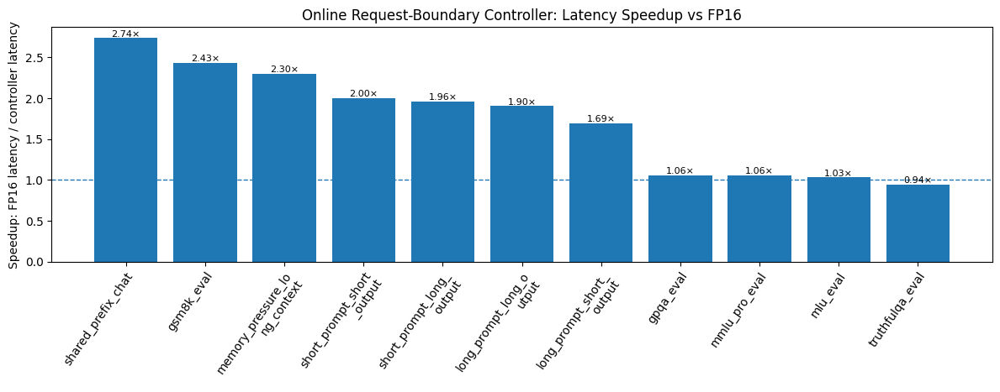
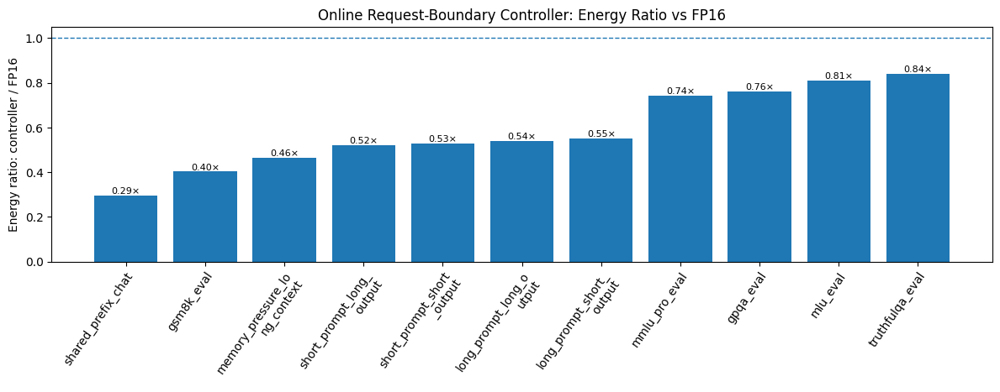
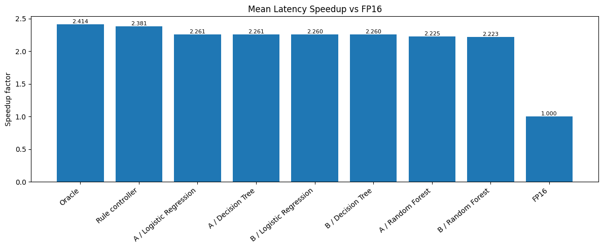
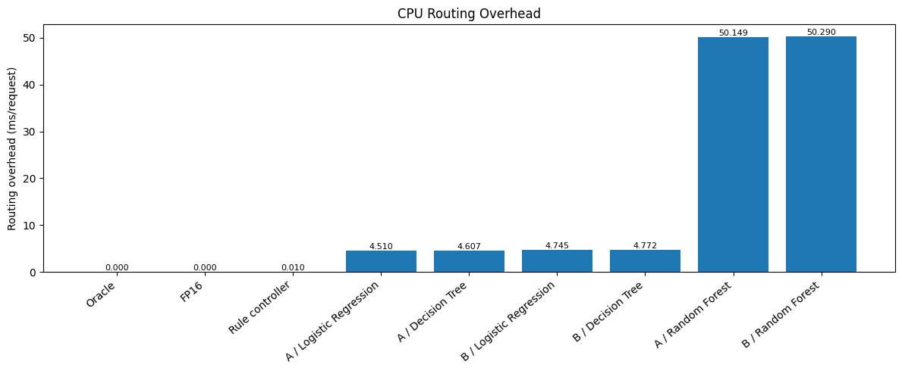

# ModeSwitch-LLM

**A lightweight phase-aware controller for cross-mode LLM inference on a single GPU.**

ModeSwitch-LLM is a benchmark-driven LLM serving project that routes each incoming request to a suitable fixed inference mode before generation begins. Instead of serving every request with one static FP16 configuration, the system uses cheap request-level features such as prompt length, expected output length, shared-prefix status, memory pressure, batch pressure, and workload/benchmark family to choose among optimized inference modes such as GPTQ 4-bit, INT8 quantization, speculative decoding, prefix caching, and hybrid configurations.

The project was developed for **ECE-GY 9483 / CSCI-GA.3033: Efficient AI and Hardware Accelerator Design** and evaluated on a **single NVIDIA A100 40 GB GPU** using **Meta-Llama-3.1-8B-Instruct** served through **vLLM**.

---

## Headline Results

| Metric | Result |
|---|---:|
| Mean latency speedup vs FP16 on deployment-style workloads | **2.10×** |
| Mean energy ratio vs FP16 on deployment-style workloads | **0.48×** |
| Energy reduction vs FP16 | **51.7% lower energy/token** |
| Mean benchmark accuracy delta vs FP16 | **+0.17 percentage points** |
| CPU routing overhead | **~0.0096 ms/request** |
| Hardware | **1× NVIDIA A100 40 GB** |

The learned-controller experiments showed that supervised routers can imitate the constraint-aware oracle, but they did not clearly outperform the hand-written rule controller because they introduced more CPU overhead and selected constraint-unsafe modes more often.

---

## System Overview

ModeSwitch-LLM treats inference optimizations as selectable serving modes. Each request is routed once at the request boundary before generation starts.

```text
Incoming request
      |
      v
Feature extraction
(prompt tokens, expected output tokens, shared prefix, memory pressure, batch pressure, workload tag)
      |
      v
Rule-based classification
(batched, shared-prefix, memory-pressure, prefill-heavy, decode-heavy)
      |
      v
Routing policy
(GPTQ 4-bit, INT8, speculative decoding, GPTQ + prefix caching, INT8 + continuous batching)
      |
      v
vLLM inference run + metric collection
```

The controller does **not** retrain the LLM, modify the model architecture, or switch modes token-by-token during generation. It makes one lightweight routing decision using static features available before inference.

---

## Repository Structure

```text
ModeSwitch-LLM/
├── Figures/
│   ├── combined_efficiency_quality_score.png
│   ├── confusion_matrix_A_static_only_Decision_Tree.png
│   ├── confusion_matrix_A_static_only_Logistic_Regression.png
│   ├── confusion_matrix_A_static_only_Random_Forest.png
│   ├── controller_accuracy_delta.png
│   ├── energy_ratio_vs_baseline_heatmap.png
│   ├── fixed_mode_screening_scatter.jpeg
│   ├── hybrid_mode_improvements_clean.png
│   ├── latency_speedup_vs_baseline_heatmap.png
│   ├── online_controller_mode_selection_one_vote_per_family.png
│   ├── online_controller_selected_mode_counts_raw.png
│   ├── online_split_energy_ratio_vs_fp16.png
│   ├── online_split_latency_speedup_vs_fp16.png
│   ├── policy_cpu_routing_overhead.png
│   ├── policy_energy_ratio_vs_fp16.png
│   ├── policy_latency_oracle_capture.png
│   ├── policy_latency_speedup_vs_fp16.png
│   └── total_latency_heatmap.png
│
├── benchmark_data/
│   ├── alpacaeval2_lc_eval.jsonl
│   ├── gpqa_eval.jsonl
│   ├── gsm8k_eval.jsonl
│   ├── judge_scores_sidecar.jsonl
│   ├── mlu_eval.jsonl
│   ├── mmlu_pro_eval.jsonl
│   ├── mt_bench_eval.jsonl
│   └── truthfulqa_eval.jsonl
│
├── controller/
│   ├── __init__.py
│   ├── classifier.py
│   ├── features.py
│   └── router.py
│
├── __init__.py
├── baseline_smoke_test.ipynb
├── benchmark_modes.py
├── build_judge_sidecar.py
├── config.py
├── final_test_controller.ipynb
├── learnable_controller_experiments.ipynb
├── metrics.py
├── model_loader.py
├── modes.py
├── reporter.py
├── runner.py
├── stress_test_plots.ipynb
├── test_benchmarks.py
├── workloads.py
├── requirements.txt
└── README.md
```

---

## Main Components

### `config.py`

Defines the global experiment configuration:

- project paths for results, plots, logs, temporary files, and benchmark sidecars;
- base model and tokenizer settings;
- vLLM runtime settings;
- candidate inference modes;
- synthetic and benchmark workloads.

### `modes.py`

Converts abstract mode definitions into runtime-ready mode objects.

Supported single modes include:

- `fp16_baseline`
- `int8_quant`
- `awq_4bit`
- `gptq_4bit`
- `speculative_decoding`
- `kv_cache_compression`
- `prefix_caching`
- `chunked_prefill`
- `continuous_batching`
- `cuda_graphs`

Supported hybrid modes include:

- `gptq_plus_prefix_caching`
- `int8_plus_continuous_batching`

### `workloads.py`

Builds concrete runtime workloads from abstract workload definitions.

It supports:

- synthetic prompt generation for SS, SL, LS, and LL workload cells;
- repeated-prefix chat workloads for prefix caching;
- memory-pressure long-context workloads;
- benchmark sidecar loading from JSONL, JSON, or CSV;
- benchmark-specific answer-format instructions.

### `runner.py`

Runs one benchmark trial for one runtime mode and one workload.

It handles:

- model loading and unloading;
- vLLM async streaming;
- TTFT and TBT timing;
- continuous-batching experiments through concurrent requests;
- prefix-caching experiments through prime-and-follow-up prompts;
- artificial memory pressure;
- GPU energy polling with NVML;
- CPU and GPU memory tracking;
- benchmark quality metrics.

### `metrics.py`

Defines the `BenchmarkResult` schema and computes derived metrics:

- TTFT;
- TBT mean, median, p95, p99, and standard deviation;
- total latency;
- prefill and decode latency;
- throughput;
- GPU and CPU memory statistics;
- energy per token;
- exact match;
- token F1;
- ROUGE-L;
- benchmark-specific metrics for MMLU-Pro, GSM8K, TruthfulQA, GPQA, MLU, MT-Bench, and AlpacaEval-style workloads.

### `benchmark_modes.py`

Runs curated benchmark sweeps and saves:

- raw JSON results;
- raw CSV results;
- compact summary CSVs;
- aggregate CSVs;
- comparison tables vs FP16;
- markdown benchmark tables.

### `reporter.py`

Generates report bundles from benchmark outputs.

It produces:

- prepared results;
- aggregate tables;
- delta tables vs FP16;
- phase-dominance summaries;
- failure summaries;
- Pareto summaries;
- markdown reports;
- diagnostic plots.

### `build_judge_sidecar.py`

Builds external-judge score sidecars for MT-Bench-style and AlpacaEval-style evaluations using structured judging outputs.

### `controller/`

Contains the lightweight online controller.

```text
controller/
├── features.py      # extracts cheap request-level features
├── classifier.py    # classifies the request regime
├── router.py        # maps the request to a fixed inference mode
└── __init__.py      # public controller API
```

---

## Controller Policy

| Request type | Selected mode | Rationale |
|---|---|---|
| Batched / high request pressure | `int8_plus_continuous_batching` | Improves multi-request throughput and energy efficiency |
| Shared-prefix chat | `gptq_plus_prefix_caching` | Reuses repeated prefix computation and benefits from 4-bit compression |
| Memory-pressure workload | `gptq_4bit` | Strong latency and energy improvement under memory pressure |
| Short prompt / short output | `gptq_4bit` | Strong balanced latency-energy behavior |
| Short prompt / long output | `speculative_decoding` | Decode-heavy generation benefits from speculative decoding |
| Long prompt / short output | `gptq_4bit` | Strong measured balance across latency, energy, and memory |
| Long prompt / long output | `gptq_4bit` | Strong overall synthetic workload performance |
| GSM8K-style long reasoning | `speculative_decoding` | Quality-preserving long-generation acceleration |
| Multiple-choice benchmarks | `int8_quant` | Safer accuracy-efficiency tradeoff |
| Generic long or prefill-heavy request | `int8_quant` | Conservative optimized fallback |
| Remaining requests | `int8_quant` | Safe optimized default |

FP16 is retained as a conservative emergency fallback and as the reference baseline.

---

## Experimental Setup

| Category | Setting |
|---|---|
| GPU | 1× NVIDIA A100 40 GB |
| Cluster | NYU Burst |
| Backend | vLLM |
| Base model | Meta-Llama-3.1-8B-Instruct |
| Baseline | FP16 |
| Main metrics | Latency, TTFT, TBT, throughput, energy/token, peak GPU memory, quality |
| Energy measurement | NVML power polling every 50 ms with trapezoidal integration |
| Memory measurement | `torch.cuda.max_memory_allocated()` and related CUDA memory counters |
| Quality gate | ±1.5 percentage points relative to FP16 |

---

## Workloads

### Synthetic Deployment-Style Workloads

| Workload | Prompt | Output | Purpose |
|---|---:|---:|---|
| `short_prompt_short_output` | ~128 tokens | 32 tokens | Latency-sensitive interactive request |
| `short_prompt_long_output` | ~128 tokens | 128 tokens | Decode-heavy generation |
| `long_prompt_short_output` | ~1024 tokens | 32 tokens | Prefill-heavy request |
| `long_prompt_long_output` | ~1024 tokens | 128 tokens | Combined prefill/decode stress |
| `shared_prefix_chat` | ~1024 tokens | 128 tokens | Prefix-cache reuse |
| `memory_pressure_long_context` | ~2048 tokens | 128 tokens | Long-context under artificial memory pressure |

### Automatic Benchmark Workloads

The benchmark sidecars include:

- MMLU-Pro
- GSM8K
- TruthfulQA
- GPQA
- MLU
- MT-Bench
- AlpacaEval 2 LC

These benchmarks are primarily used as quality checks rather than only efficiency workloads.

---

## Main Findings

### 1. No single inference mode dominates.

The fixed-mode screening shows that optimized modes are workload-dependent. GPTQ 4-bit performs strongly on many synthetic latency and energy workloads, speculative decoding helps long-output/decode-heavy tasks, INT8 is more stable for benchmark-style quality, and prefix caching matters most when repeated context is actually present.



### 2. Hybrid modes help when the workload structure matches the optimization.

The clearest hybrid wins are:

| Hybrid | Baseline compared against | Main improvement |
|---|---|---|
| GPTQ + prefix caching | plain prefix caching | Shared-prefix latency reduced from 1903 ms to 942 ms |
| INT8 + continuous batching | plain continuous batching | Multi-request latency reduced from 1840 ms to 1361 ms |



### 3. The online controller recovers most of the useful efficiency.

The controller achieves strong latency and energy gains on synthetic serving workloads while maintaining quality within the benchmark threshold.





### 4. Learned routers did not beat the rule controller.

Random Forest achieved the highest oracle-mode match, but its CPU overhead was much higher. Logistic Regression and Decision Tree had lower overhead, but they still did not clearly outperform the hand-written controller. The rule controller remained the best practical deployment choice because its routing overhead was effectively negligible.





---

## Installation

This project is intended to run on a GPU-enabled environment with CUDA and vLLM support.

```bash
git clone https://github.com/ModeSwitch-LLM/ModeSwitch-LLM.git
cd ModeSwitch-LLM

python -m venv .venv
source .venv/bin/activate

pip install -r requirements.txt
```

For NYU Burst or a similar cluster environment, run the project from a high-capacity scratch directory and use a CUDA-enabled environment.

---

## Running Benchmarks

### Run the curated benchmark sweep

```bash
python benchmark_modes.py
```

Typical outputs include:

```text
results/raw/benchmark_results_<timestamp>.json
results/raw/benchmark_results_<timestamp>.csv
results/raw/benchmark_summary_<timestamp>.csv
results/raw/benchmark_aggregates_<timestamp>.csv
results/raw/benchmark_comparisons_<timestamp>.csv
```

### Run one benchmark by name

```python
from runner import run_single_benchmark_by_name

result = run_single_benchmark_by_name(
    mode_name="gptq_4bit",
    workload_name="short_prompt_short_output",
    trial_index=0,
)

print(result.total_latency_ms)
print(result.energy_per_token_j)
```

### Route one workload through the controller

```python
from workloads import build_runtime_workload_by_name
from controller import route_runtime_workload

workload = build_runtime_workload_by_name("short_prompt_long_output")
decision = route_runtime_workload(workload)

print(decision.selected_mode_name)
print(decision.classification_label)
print(decision.reason)
```

### Generate a report bundle

```bash
python reporter.py results/raw/benchmark_results_<timestamp>.json --output-dir results/report_<timestamp>
```

The report bundle contains prepared results, aggregates, delta tables, phase-dominance summaries, failure summaries, and plots.

---

## Quality Evaluation

The system uses two types of quality checks.

### Automatic benchmark metrics

For benchmark workloads, quality is measured using accuracy or exact match:

- MMLU-Pro accuracy
- GSM8K final-answer exact match
- TruthfulQA accuracy
- GPQA accuracy
- MLU accuracy

### Synthetic quality proxies

For synthetic generation workloads, the project uses:

- ROUGE-L against reference outputs;
- ROUGE-L similarity against FP16 outputs.

These are lightweight quality proxies and are not treated as a replacement for full human evaluation.

---

## Figures

| Figure | Description |
|---|---|
| `fixed_mode_screening_scatter.jpeg` | Fixed-mode latency speedup vs energy ratio |
| `latency_speedup_vs_baseline_heatmap.png` | Latency speedup heatmap by mode and workload |
| `energy_ratio_vs_baseline_heatmap.png` | Energy ratio heatmap by mode and workload |
| `total_latency_heatmap.png` | Mean total latency by mode and workload |
| `hybrid_mode_improvements_clean.png` | Hybrid-mode improvements over single-mode baselines |
| `online_split_latency_speedup_vs_fp16.png` | Online controller latency speedup by workload family |
| `online_split_energy_ratio_vs_fp16.png` | Online controller energy ratio by workload family |
| `controller_accuracy_delta.png` | Benchmark accuracy delta vs FP16 |
| `online_controller_selected_mode_counts_raw.png` | Raw controller mode-selection counts |
| `online_controller_mode_selection_one_vote_per_family.png` | One-vote-per-family controller selections |
| `policy_latency_speedup_vs_fp16.png` | Learned/rule/oracle policy latency comparison |
| `policy_energy_ratio_vs_fp16.png` | Learned/rule/oracle policy energy comparison |
| `policy_latency_oracle_capture.png` | Policy oracle-capture comparison |
| `policy_cpu_routing_overhead.png` | CPU routing overhead comparison |
| `combined_efficiency_quality_score.png` | Combined efficiency-quality score |
| `confusion_matrix_A_static_only_Decision_Tree.png` | Decision Tree oracle-label confusion matrix |
| `confusion_matrix_A_static_only_Logistic_Regression.png` | Logistic Regression oracle-label confusion matrix |
| `confusion_matrix_A_static_only_Random_Forest.png` | Random Forest oracle-label confusion matrix |

---

## Limitations

ModeSwitch-LLM is a practical single-GPU routing study rather than a full production serving system.

Current limitations include:

- experiments are centered on one base model and one GPU class;
- synthetic ROUGE-L is only a lightweight proxy for generation quality;
- learned policies were trained on a relatively small routing dataset;
- some modes are meaningful only under specific serving conditions, such as repeated prefixes or concurrent requests;
- the controller makes one request-boundary decision and does not switch modes during generation.

---

## Summary

ModeSwitch-LLM shows that simple request-aware routing can recover substantial inference efficiency on a single GPU. The main result is not that one optimization always wins, but that different request families benefit from different modes. A lightweight request-boundary controller can exploit this structure with almost no routing overhead, achieving strong latency and energy gains while preserving benchmark quality close to FP16.
